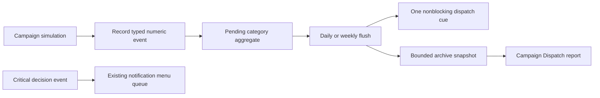

# Reporting System Redesign Plan

## Purpose

Replace the current stream of isolated campaign messages with a bounded, native Mount & Blade 1.011 reporting system. The new system should preserve urgent player-facing alerts, collect routine simulation outcomes into meaningful bundles, and make the result reviewable from the existing Reports screen.

Working name: **Campaign Dispatch**.

This is not a plan to hide information. It is a plan to record information once, rank it by player relevance, deliver a concise summary at a sensible cadence, and retain a short readable history.

## Implementation Status

The source implementation is complete as of 2026-08-11. Campaign Dispatch uses fixed `trp_player` slots, O(1) event recording, a four-entry archive per category, a Reports menu, and daily/weekly flush points. The initial migration covers settlement pressure, health, roads, captives, contracts, diplomacy, mini-faction activity, Slaver routes, and Black Khergit activity.

The remaining unchecked behavioral matrix is intentional: it requires a live campaign playthrough to tune thresholds and validate presentation cadence, not another source-only refactor.

## Audit Result

### Current State

- `display_message` appears at **1,394 source emission sites** under `src/`. This is a static source count, not a measured in-game message count.
- The volume controls in `src/menus/0000_hardcoded_mb1011/game_options_3.py` only set `$g_sod_hide_messages` to `0`, `-1`, or `-2`. Several campaign triggers temporarily use `set_show_messages` when the value is `-2`.
- Suppressed messages are generally not preserved in a player-readable record. The player gains quiet at the cost of visibility.
- `script_add_notification_menu` queues blocking notification menus in `trp_notification_menu_types`, `trp_notification_menu_var1`, and `trp_notification_menu_var2`. It has no deduplication, priority, or hard queue limit. It should remain reserved for decision-required events, not routine campaign news.
- The Reports menu already contains useful detailed reports, but they are disconnected pages rather than a shared current-events overview. The mercenary status, market, and world-activity reports are one clear example of a useful but fragmented report chain.
- `script_sod_quest_journal_describe_to_s2` proves that the module can build a structured, dynamic report from numeric state at read time. That pattern is the correct precedent for a Campaign Dispatch.
- Diplomacy already has a separate `All / Major / Critical` notification filter through `$g_sod_diplomacy_notification_level`. Keep it as a compatibility layer during migration; do not replace it with an unrelated second diplomatic filter.

### Native Engine Constraints

- Persistent state is numeric slots and globals. Do not attempt to persist arbitrary generated strings as an event log.
- Dynamic strings should be composed only when a report is opened or a summary is delivered. Use `s68` through `s99` for new report text and staging, following project policy.
- A historical event log must be bounded. Use fixed category state plus a short ring buffer of summarized dispatches, not an unbounded list.
- `trp_temp_array_a`, `trp_temp_array_b`, and `trp_temp_array_c` are transient shared workspaces. Do not use them as Campaign Dispatch storage.
- The recorder must be O(1): it may update slots, but it must not scan every center, party, or faction when a single event occurs.
- Build string text from stored entity type and numeric id only when needed. A center id should become a center name only in a delivery or menu script.

## Design Decision

Build a shared event-intelligence layer between campaign simulation and player-facing text.

The recorder collects facts. The delivery policy decides whether the player sees an immediate alert, a compact dispatch cue, or only an archive entry. Existing deep reports remain the place for full system state; the Campaign Dispatch becomes the place to learn what changed and where to look next.

## Delivery Tiers

| Tier | Purpose | Delivery | Examples |
| --- | --- | --- | --- |
| Critical decision | Player action or a choice is required now. | Existing notification menu, with future dedupe protection. | Player fief captured, peace offer, faction change involving the player, quest deadline decision. |
| Immediate alert | The player can act now and the event directly affects the player, their party, or a nearby area. | One direct `display_message`, then also record a dispatch event. | Severe outbreak in a player-held center, nearby raid, player-funded operation fails, player prisoner train is attacked. |
| Dispatch headline | Important background information, but no immediate response is required. | At most one nonblocking Campaign Dispatch cue per flush window. | Several migrations, tax-courier arrivals, hostile road activity, remote relief operations. |
| Archive only | Routine or historical information that remains useful when inspected. | Report only. | Minor remote health work, repeated non-player convoy movement, routine world-pressure changes. |
| Debug | Development-only telemetry. | `$g_sod_debug == 1` only. | Slot diagnostics, spawn adjustments, internal logistics accounting. |

### Never Batch These Blindly

- Results of the player pressing a menu option, buying something, accepting a contract, or issuing an order.
- Quest state changes, tactical objectives, player-party danger, and nearby hostile contact.
- The loss, capture, siege, or immediate crisis of a player-owned center.
- Diplomatic offers, faction membership changes, or any event that opens a response menu.
- Player-selected prison, trade, health, or mercenary actions.
- Debug output. Debug output should be made cleaner separately, not silently placed in player reports.

## Campaign Dispatch Categories

Use a small, stable category set. `0` is no category; actual categories begin at `1`.

| Id | Category | Initial families |
| --- | --- | --- |
| 1 | Settlements and population | Migration, desperation, civilian displacement, garrison recruitment pressure. |
| 2 | Health and relief | Outbreaks, quarantine, relief parties, garrison infirmary losses. |
| 3 | Roads and treasury | Tax couriers, trade-route changes, player-relevant contract delivery. |
| 4 | Security and raids | Looter growth, remote raids, Black Khergit pressure, local response. |
| 5 | Captives and prisoner logistics | Train arrivals, overcrowding effects, prisoner-market pressure. |
| 6 | Mercenaries and contracts | Guild demand, AI mercenary assignments, renewals, contract failures. |
| 7 | Realm and diplomacy | Treaties, incidents, wars, internal politics. |
| 8 | World activity | Slavers, mini-factions, invasion pressure, major global movement. |

Do not create one category for every subsystem. Categories are player-facing themes, not implementation folders.

## Persistent Ledger Layout

### Owner and Constants

- Store the ledger on `trp_player`. It is persistent, always available, and Campaign Dispatch is player-specific.
- Add a contiguous `slot_troop_sod_report_*` range after the current highest troop slot allocation. The current authored highest troop slot is `393`; allocate the final range only after checking `build/verify_slot_allocations.py`.
- Define category, severity, subject-kind, reason, archive-size, and slot-stride constants in `src/constants/module_constants.py` with one system comment block.
- Do not reuse temp-array slots or the legacy notification-menu troop slots.

### Pending Aggregate Per Category

Each category owns a fixed current-window aggregate:

| Field | Meaning |
| --- | --- |
| Event count | Number of contributing events. |
| Total magnitude | Sum of people, denars, trains, parties, or another category-defined quantity. |
| Maximum severity | Highest severity observed in the window. |
| Headline magnitude | Magnitude of the selected representative event. |
| Primary subject kind and id | Main entity for the headline. |
| Secondary subject kind and id | Destination, rival, target, or related entity. |
| Dominant reason | Most important cause code for the headline. |
| First day and last day | Bounds for the aggregate. |
| Unread flag | Allows the menu to badge categories without clearing the record. |

When a new event is more severe than the current headline, replace the headline. For equal severity, prefer the greater headline magnitude. Always add to the aggregate count and total magnitude. This preserves scale while keeping the report readable.

### Bounded Archive

- Keep four completed summary snapshots per category in a circular ring buffer.
- Each snapshot stores day, count, total magnitude, severity, headline subject pair, and dominant reason.
- Archive only completed aggregates, not raw individual lines.
- The archive is intentionally a history of dispatches, not a forensic event database. Existing detailed reports remain the source of current full state.

This layout costs a known, fixed number of slots, performs only constant-time updates, and avoids making the save file carry arbitrary text.

## Shared API

### Core Scripts

Create these scripts in `src/scripts/ZY_helper_scripts/`, then register them in `src/scripts/_order_scripts.txt` near other cross-system helpers.

- `script_sod_report_record_event`
  - Parameters: category, severity, primary subject kind/id, secondary subject kind/id, magnitude, reason.
  - Validates the category and severity.
  - Updates only the relevant `trp_player` slot block.
  - Does not compose text and does not scan the world.

- `script_sod_report_should_alert_to_reg`
  - Parameters: category, severity, primary subject kind/id.
  - Returns `reg0 = 1` only when the event belongs in the immediate-alert tier.
  - Centralizes player ownership, player-faction, proximity, quest, and severity checks.

- `script_sod_report_flush_pending`
  - Parameters: announce or silent mode.
  - Copies non-empty category aggregates into their archive rings, marks them unread, and clears only the pending aggregate.
  - Emits no more than one generic dispatch cue per campaign day.

- `script_sod_report_describe_overview_to_s68`
  - Builds the overview, unread count, urgent categories, and short recent summary.

- `script_sod_report_describe_category_to_s68`
  - Uses `$g_sod_report_selected_category` to build one current aggregate plus its archive entries.

- `script_sod_report_mark_category_read`
  - Clears the unread marker only for the category the player opened.

### Typed Wrappers

Use wrappers at call sites so source systems remain readable and object types never become ambiguous:

- `script_sod_report_record_center_event`
- `script_sod_report_record_route_event`
- `script_sod_report_record_prisoner_event`
- `script_sod_report_record_contract_event`
- `script_sod_report_record_faction_event`

The wrappers may translate their source-specific values into the core API. They must not contain substantial policy or text-building logic.

### Severity Rules

Use four severity values:

- `routine`: useful only in a report unless the player chooses a very verbose delivery mode later.
- `notable`: contributes to a normal dispatch headline.
- `urgent`: adds a report cue and may be immediate if it affects the player.
- `critical`: immediate alert; use a notification menu only if a response is required.

Severity is a delivery concern, not a color constant. The final presentation can still choose existing colors by severity.

## User Experience

### New Reports Entry

Add **Read campaign dispatches** near the top of `mnu_reports` in `src/menus/0000_hardcoded_mb1011/reports.py`.

Add a new menu fragment, for example `src/menus/reports/campaign_dispatch.py`, with:

- `mnu_campaign_dispatch`: overview and unread categories.
- `mnu_campaign_dispatch_detail`: selected category, current headline, totals, and four archived summaries.
- `mnu_campaign_dispatch_settings`: delivery mode.

Register the fragment in `src/menus/_order_game_menus.txt` beside `reports/quest_journal_report.py` and other top-level report fragments.

### Overview Content

The overview should show:

- An urgent section first, if one exists.
- Unread category count and last dispatch day.
- One short line per category with current/new activity.
- Buttons into settlement, health, roads, security, captives, contracts, realm, and world-activity detail.
- Links out to existing deep reports, such as trade, mercenary market, prisoner, diplomacy, and mini-faction reports.

Example summary lines:

- `Settlement dispatch: 5 movements, 74 people. Hunger drove departures from Suno toward Uxkhal.`
- `Road and treasury dispatch: 3 courier deliveries, 970 denars reached your coffers.`
- `Security dispatch: 2 raider bands formed near Praven; 18 people fled the district.`

The examples describe synthesized text. The implementation should select its nouns and numbers from the stored numeric headline, not preserve the original message strings.

### Delivery Settings

Add a separate Campaign Dispatch setting. Do not redefine the old `Messages: All / Fewer / Fewest` option, because that setting still controls un-migrated systems.

| Mode | Behavior |
| --- | --- |
| Standard | One compact dispatch cue after a flush when there is unread noteworthy news; urgent player-relevant events still alert immediately. |
| Quiet | Immediate alerts only; all routine and notable news is available in the Dispatch. |
| Archive only | No map cue from the Dispatch; critical decision notifications and player-action results remain visible. |

The recorder must always run regardless of this setting. Quiet delivery must not mean lost information.

### Existing Diplomacy Filter

- Keep `$g_sod_diplomacy_notification_level` and its existing menu while diplomacy is being migrated.
- Make diplomatic event wrappers derive their severity from that setting during the transition.
- Only after all diplomatic emitters use the shared reporter should the project consider replacing the diplomacy filter with per-category Dispatch preferences.

## Initial Migration Targets

The table below is intentionally selective. It targets repeated background simulation, not every `display_message` in the project.

| Source | Static direct-message sites | Refactor action | Preserve immediate |
| --- | ---: | --- | --- |
| `sod_center_weekly_migration.py` | 20 | Replace nested-loop migration messages with Settlement events. Aggregate moves, people, cause, and the strongest source/destination pair. | Player-owned center reaches an extreme population or food threshold. |
| `sod_center_weekly_security_desperation.py` | 25 | Record looter formation, hardship migration, and worst causal pressure in Settlement/Security categories. | Severe player-center collapse or a directly actionable nearby threat. |
| `sod_center_public_health.py` | 14 | Bundle remote relief work, infirmary losses, and routine health changes. | Player-owned outbreak start/end, player company morale impact, and player intervention feedback. |
| `sod_tax_couriers.py` | 14 | Aggregate ordinary outgoing and delivered player taxes by flush. Keep debug messages debug-only. | Player interception, seizure, loss, or an action outcome. |
| `sod_prisoner_economy.py` | 19 | Add one Captives summary for routine train arrivals and pressure. | Scout sightings, accepted objectives, destroyed player-relevant trains, and explicit player choices. |
| `sod_black_khergit_horde.py` | 35 | Replace the one shared daily raid-report suppression with category counters and one dominant security headline. | Camp discovery, player bargain, battle, rescue, defeat, and local threat near the player. |
| `sod_mini_faction_incidents.py` | 24 | Record remote global incidents in World activity. Link to the existing world-activity report. | Player countermeasure results and companion/player reactions. |
| `sod_slavers_black_market.py` | 16 | Record background market and route changes in World activity/Captives. | Player contracts, rescues, confrontations, and resulting choices. |
| `sod_trade_network.py` | 10 | Leave player-funded contract completion direct initially; migrate only repeated remote route signals after a focused audit. | Player-funded trade results. |

### Important Specific Fixes

- The weekly triggers `ST04_weekly/entry_0104.py` and `ST04_weekly/entry_0105.py` execute migration and security/desperation back-to-back. Add an explicitly ordered weekly Campaign Dispatch flush immediately after those stages so their results become one coherent summary.
- Do not use `$g_sod_hide_messages == -2` as the event-recording condition. It should affect presentation only; the ledger must retain the event.
- `slot_faction_black_khergit_last_raid_report_day` currently suppresses different raid news through one shared day marker. Replace the player-facing suppression behavior with separate event counts and a selected headline. Keep any simulation cooldown semantics separate from reporting semantics.
- `slot_center_health_last_report_day` and `slot_faction_sod_merc_last_report_flags` should be reviewed as each family migrates. Do not remove a gameplay cooldown merely because it also throttles a message.

## Notification Queue Refactor

The Campaign Dispatch reduces pressure on the notification queue, but the queue itself still needs a narrow hardening pass.

- Preserve `script_add_notification_menu` as the compatibility entrypoint.
- Add a new critical-only wrapper, for example `script_sod_enqueue_critical_notification`.
- The wrapper should calculate a numeric dedupe key from menu type and primary subject, reject duplicate pending entries, and cap the queue at a documented fixed size.
- Add priority storage only if the caller audit shows a real need to evict low-value entries. Do not turn routine background reports into modal menus.
- Audit the current callers before changing their semantics. There are twelve caller sites plus the script definition; they largely concern player-impacting faction, center, battle, and raid events.

## Implementation Checklist

### Phase 0: Baseline and Contract

- [x] Record a before-build and source-audit baseline for the selected emitters.
- [x] Confirm no source report system already owns the proposed `slot_troop_sod_report_*` range.
- [x] Add system constants for categories, severity, subject kinds, reasons, archive size, and strides.
- [x] Initialize `$g_sod_report_delivery_mode`, `$g_sod_report_last_nudge_day`, and `$g_sod_report_selected_category` in `game_start`.
- [x] Document the guarantee: report recording is persistent numeric state; strings are generated at delivery time only.

### Phase 1: Core Ledger and Menu

- [x] Implement the O(1) core recorder and typed wrappers.
- [x] Implement pending flush, unread markers, and four-entry per-category archive rings.
- [x] Implement overview and category-description scripts using `s68` through `s99` scratch registers.
- [x] Add `campaign_dispatch.py` and order it with the report menus.
- [x] Add the Reports entry and Dispatch delivery-mode menu.
- [x] Confirm opening the Dispatch silently flushes pending events without producing a duplicate map message.

### Phase 2: Settlement Bundle

- [x] Route all background migration messages in `sod_center_weekly_migration.py` through the Settlement wrapper.
- [x] Route background desperation, looter formation, and hardship migration from `sod_center_weekly_security_desperation.py` through Settlement/Security wrappers.
- [x] Insert the weekly flush directly after the two weekly stages in trigger order.
- [x] Keep player-owned extreme conditions and nearby actionable threats immediate.
- [x] Verify multiple same-week movements become one summary, rather than one line per source/destination pair.

### Phase 3: Health, Roads, and Captives

- [x] Route remote public-health processing and relief outcomes into Health dispatches.
- [x] Leave player interventions, company morale feedback, and player-owned outbreak transitions direct.
- [x] Aggregate normal tax-courier departures and deliveries into Roads and treasury.
- [x] Route routine prisoner-train arrivals and prison pressure into Captives.
- [x] Preserve player scout sightings, objectives, seizures, destruction, and release outcomes as immediate feedback.

### Phase 4: Security, World Activity, and Contracts

- [x] Migrate background Black Khergit road activity to Security, preserving direct player encounter and battle messaging.
- [x] Migrate remote mini-faction and Slaver world incidents to World activity.
- [x] Add mercenary contract state summaries for AI assignments, renewals, reassignment, and guild return to Mercenaries and contracts.
- [x] Add contextual links from applicable Campaign Dispatch categories to existing health, trade, security, captive, contract, diplomacy, and world-activity reports.
- [x] Re-audit `sod_trade_network.py`; retain player-funded result messages and record a Roads summary alongside them.

### Phase 5: Diplomacy and Notification Queue

- [x] Add diplomatic event recording through the typed faction wrapper while honoring `$g_sod_diplomacy_notification_level`.
- [x] Migrate routine remote diplomatic incidents to Realm and diplomacy summaries.
- [x] Retain war declarations, peace offers, player envoy results, and player-faction incidents as immediate alerts.
- [x] Harden `script_add_notification_menu` as a bounded, duplicate-aware compatibility FIFO.
- [x] Preserve existing critical notification callers; no caller migration is needed because the public entrypoint now provides the guard.

### Phase 6: Polish and Tuning

- [ ] Tune severity rules from real campaign playthroughs rather than source counts alone.
- [ ] Add optional per-category quieting only after the three global delivery modes are stable.
- [ ] Make Dispatch overview wording concise enough to scan at a glance.
- [ ] Add navigation copy from Dispatch categories to existing deep reports.
- [ ] Remove obsolete report-only throttles only when the replacement preserves the underlying gameplay timing.

## Test Plan

### Static Tests

- [x] Add `build/test_campaign_dispatch_static.py`.
- [x] Assert the core recorder exists, is registered, and updates only the configured `trp_player` report slot range.
- [x] Assert the recorder does not use `trp_temp_array_*` or attempt to persist generated strings.
- [x] Assert the flush has a fixed archive bound and a one-cue-per-day guard.
- [x] Assert the report menu is ordered and reachable from `mnu_reports`.
- [x] Assert current player-facing menus still use direct feedback paths.
- [x] Assert selected migration and desperation emitters call report wrappers instead of their former repeated background `display_message` blocks.
- [x] Assert player-owned outbreak alerts, prisoner objectives, and direct contract outcomes remain immediate.
- [x] Add a focused notification-queue static test before modifying the existing queue.

### Behavioral Matrix

- [ ] Trigger several migration transfers in one weekly window; verify one Settlement summary records total people, count, dominant cause, and strongest route.
- [ ] Trigger both looter formation and migration; verify Settlement and Security remain separate but each produces one readable entry.
- [ ] Start a remote outbreak; verify it reaches Health archive without a direct message in Quiet mode.
- [ ] Start a severe player-owned outbreak; verify the immediate warning and Health archive entry both exist.
- [ ] Deliver several tax couriers; verify one Roads and treasury summary contains the total denars.
- [ ] Intercept a courier or prisoner train as the player; verify immediate tactical text remains.
- [ ] Trigger multiple Black Khergit background actions in one day; verify the summary retains count and highest-impact headline rather than suppressing all but the first.
- [ ] Check Standard, Quiet, and Archive-only modes with the same event set.
- [ ] Open Campaign Dispatch after an archive-only period; verify no information was lost.
- [ ] Fill the archive ring, then add one more snapshot; verify only the oldest summary is overwritten.

### Build and Regression Checks

- [ ] Run the focused Campaign Dispatch test.
- [ ] Run existing health, population, economy, prisoner, mercenary, diplomacy, and mini-faction static suites.
- [ ] Run `py build\\build_all.py --no-cache`.
- [ ] Confirm doctor reports zero warnings.
- [ ] Confirm slot verification reports zero warnings and zero errors.
- [ ] Confirm generated compile imports succeed.
- [ ] Inspect generated output before touching live `_export/*.txt` files.

## Acceptance Criteria

- A busy weekly simulation produces a small number of readable dispatch summaries, not a scrolling sequence of nearly identical lines.
- The player can still learn what happened while using the quietest delivery setting.
- Critical events and player decisions remain immediate and actionable.
- The report system has fixed storage, bounded runtime cost, and no world scans at event-record time.
- Existing detailed reports remain useful and are easier to discover from the Dispatch.
- No generic message suppressor is used as a substitute for recording state.
